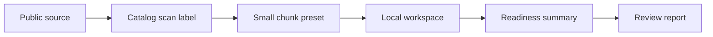
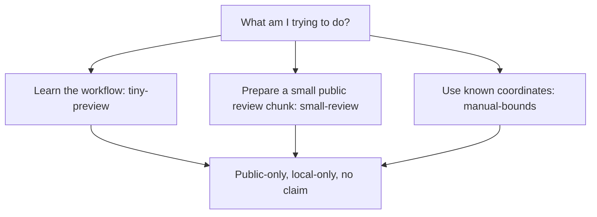

# Scroll Review Tooling

A small, reproducible review-gate toolkit for blind-first candidate
assessment. It validates reviewer responses, records second-check
decisions, and emits attention signals only when a controlled next step
is supported.

Its unique public role is review readiness: it helps teams decide whether a
candidate path is controlled, reviewable, reproducible, and claim-safe enough
for a separate private next step. It does not identify content, read source
material, or create new evidence.

The runnable demo fixture is intentionally synthetic and data-free.
A review repository may also include real example outputs under
`docs/examples/` so reviewers can see the workflow in context. Those
examples are illustrative artifacts only: no OCR, no transcription, no
reading, and no public or prize claim.

Current release-candidate line: `v1.0 local operator`. See `CHANGELOG.md` for
the public-safe change summary, `docs/LOCAL_OPERATOR_GUIDE.md` for the local
app flow, and `docs/OPERATOR_APP_ROADMAP.md` for the operator roadmap.

## ELI5: How It Works

Think of this tool as a careful checklist and status board for scroll-review
work. It does not look at a scroll and tell you what it says. Instead, it looks
at small JSON summary files that already exist and asks: is this review package
complete, controlled, safe to discuss, and ready for the next private step?

A new Windows user can start with the clearest current entry point:

```text
START_HERE.cmd
```

This is the primary desktop/Windows path. It checks the setup and opens the local app at `127.0.0.1`. The main screen is
now a seven-step wizard:

```text
Setup -> Workspace -> Choose data -> Limit chunk -> Save locally -> Create summary -> Review
```

The left side shows which step is ready, waiting, or blocked. The middle shows
the active step and the next button to click. The right side explains blockers
and lists generated output files. The intended beginner path is:
**Use suggested workspace and check**, **Check public catalog**, **Create chunk
plan**, **Save chunk locally**, **Create readiness summary**, then **Open review
reports**.

`START_HERE.cmd` also writes a small local start log to
`demo/out/start_here.log`, checks that Python is available, and stops with a
plain message if the default local app port is already in use.

On a first run, the screen stays deliberately quiet: short explanation, active
wizard step, one primary button, and the local/no-claim safety note. Generated
report links, readiness meters, and the optional Queue/Kanban Operator board
appear as supporting views after the flow has something useful to show. Manual
step controls and the raw action log are folded into **Advanced step details**
so a new user does not have to choose between debugging buttons.
Use the **Info** button in the app for a short explanation of what the tool is
for, how it works, and what it will not do. The app also includes a light/dark
theme toggle and starts in dark violet mode by default. The public source
repository link is kept as a small utility link, separate from the main workflow
navigation.

The newest Operator Studio flow also adds **Load public scan chunk**. This is a
guided public-data path for small chunks only: accept the suggested local
workspace outside this repo, check the public catalog, fetch a tiny public/demo
chunk, and generate a no-claim readiness summary. Raw chunk files live in the
workspace beside the repo; JSON/HTML/Markdown reports live under ignored
`demo/out/`. It does not download full volumes, use private credentials, run
OCR, infer letters, read text, or submit claims.

The app explains that path as a **Data Journey** before asking you to choose
anything:



When you choose data, the UI explains why the source is available, what scan
label is being used, why the preset is small, where raw bytes are stored, and
what the app will not do. Use `tiny-preview` first to learn and test the flow,
`small-review` for a bounded public review start, and `manual-bounds` only when
bounds were already chosen by a separate controlled workflow.



The source picker shows public-only source cards with adapter status, suggested
scan/preset, and maximum fetch size. If the optional adapter is not installed,
the app keeps it visible as setup-needed and continues to offer the built-in
public demo path. Source cards also show that credentials are not required,
full-volume requests are blocked, and optional adapter-backed fetching is not a
release-gate requirement.
The individual step buttons stay available under **Advanced step details** for
debugging when a blocker needs inspection.

Python users can start the same app with:

```bash
python scripts/operator_server.py
```

You can also check whether the local setup is usable directly:

```bash
python scripts/operator_doctor.py
```

On Windows, double-click `CHECK_LOCAL_SETUP.cmd`. It writes
`demo/out/operator_doctor.html`, a plain setup report that says whether Python,
the required local files, the session manifest, and the generated-output folder
are ready.

The older report-only entry point remains available:

```bash
python scripts/local_operator.py
```

On Windows, `OPEN_LOCAL_OPERATOR.cmd` builds and opens the report-only page.
Use `RUN_LOCAL_OPERATOR.cmd` when you want the command to print paths without
opening a browser. Both write `demo/out/operator.html`, `demo/out/dashboard.html`,
and `demo/out/operator_summary.md`.

You can pass a local session manifest to either Windows launcher, or drag a
session manifest onto it:

```text
OPEN_LOCAL_OPERATOR.cmd demo\session_manifest.json
```

For a local review-session folder, use the session starter:

```text
START_REVIEW_SESSION.cmd
```

You may drag JSON reviewer responses onto it. The starter writes an ignored
`sessions/...` folder with an inbox template, validation outputs, second-check
status, attention status, and `session_summary.md`. It accepts JSON review
responses only; it is not a raw-data importer.

The local app is the interactive surface. The generated operator page and
dashboard are still static reports, useful for sharing or archiving.

The lower-level dashboard command remains available:

```bash
python scripts/local_dashboard.py
```

That command runs the synthetic demo checks, validates the manifests, runs the
release audit, and writes a local dashboard to `demo/out/dashboard.html`. On
Windows, double-clicking `RUN_LOCAL_DASHBOARD.cmd` runs the same local flow.

The dashboard then shows the important bits in plain language:

- whether the current bundle passed the no-claim safety checks;
- which readiness stage it reached, such as `surface-ready`,
  `preflight-ready`, `review-ready`, or `handoff-ready`;
- which blockers still need human attention;
- which controlled private next step is suggested by the existing summaries.

So the tool is not a reading machine. It is the local operator layer around the
reading work: it helps a team avoid messy handoffs, missing controls, unsafe
claims, and wasted review effort before private research work continues
elsewhere.

## What It Does

- Creates a blind review response template from a bundle manifest.
- Validates reviewer responses against required acknowledgements and
  score ranges.
- Separates ambiguous review outcomes from controlled-next-step support.
- Validates public-safe review-pack, surface/VC3D, and full-volume
  preflight manifests without running inference.
- Emits no-claim review dossiers from existing workflow outputs.
- Inspects existing JSON outputs into a compact no-claim readiness summary.
- Rolls existing outputs into a public-safe evidence readiness ladder:
  `manifest-valid`, `surface-ready`, `preflight-ready`, `review-ready`, and
  `release-ready`.
- Validates review-to-reading handoff manifests for controlled private next
  steps such as surface continuity review, VC3D sheet-switch review, model
  evaluation, high-resolution rescan priority, or private review.
- Prioritizes existing readiness and handoff JSONs into a deterministic
  no-claim next-step queue.
- Checks the local setup with an operator doctor so non-experts can see whether
  Python, required files, output permissions, and session validation are ready.
- Guides a public-only small scan-chunk workflow: public source catalog,
  metadata-safe starting point, local workspace check, chunk plan, limited fetch,
  checksum, and scan-data readiness summary.
- Runs a local Operator Studio app on `127.0.0.1` with a first-run wizard,
  active-step guidance, one primary next action, workspace input, a main-flow
  public data selector, folded diagnostics, optional readiness meters,
  traffic-light status, a priority queue, an optional Kanban board, an Info
  panel, a dark-by-default light/dark theme toggle, a separated source-code
  utility link, and generated-report links.
- Renders a local operator start page that explains the safe steps before a
  reviewer opens the detailed dashboard. The page links only to generated local
  files.
- Renders a local static HTML dashboard from existing JSON outputs so a reviewer
  can inspect status, blockers, and priority without reading raw JSON.
- Runs a release audit for repository scope, secrets, heavyweight
  artifacts, and generated outputs.

## Sample Review Pack

The included images are synthetic fixtures. They show the intended
review format without carrying any real Scroll data.


The workflow is deliberately conservative: a reviewer can support a
controlled next step, but the tooling does not authorize transcription,
OCR, a public claim, or a prize submission.


## Why Synthetic Images?

The synthetic demo is what makes the code path easy to test and audit.
Real example outputs can be added separately under `docs/examples/`
when the repository is being used for team review or public presentation.

If a team wants to review candidate material, keep the full evidence
bundle separate and use this repository to validate the response and
second-check workflow around that bundle.

## Interface

The recommended interface is the local operator app. It runs only on
`127.0.0.1`, uses the existing CLI as its engine, and exposes a small set of
safe actions: check a session, build the demo dashboard, open generated reports, and review
the local readiness queue. The CLI remains the automation and test surface.

## Demo

For the interactive local app:

```bash
python scripts/operator_server.py
```

On Windows, double-click `START_HERE.cmd` or `RUN_LOCAL_APP.cmd`.

For report-only operation, run the local setup doctor first if this is a new
machine:

```bash
python scripts/operator_doctor.py
```

On Windows, double-click `CHECK_LOCAL_SETUP.cmd` if you only want the setup
report. Then run the report-only operator entry point:

```bash
python scripts/local_operator.py
```

On Windows, double-click `OPEN_LOCAL_OPERATOR.cmd` to run the same safe local
checks and open `demo/out/operator.html`. Use `RUN_LOCAL_OPERATOR.cmd` when you
want the command to print paths without opening a browser.
Open `demo/out/operator.html` first. It explains the current status and links
to the generated dashboard, JSON summaries, and share summary.

To use a different local session manifest:

```bash
python scripts/local_operator.py --session demo/session_manifest.json
```

To create an isolated local review-session folder:

```bash
python scripts/start_session.py --demo
```

For the lower-level dashboard flow:

```bash
python scripts/local_dashboard.py
```

On Windows, you can also double-click `RUN_LOCAL_DASHBOARD.cmd`. It runs the
same local command and then prints the dashboard path.

It runs the demo, strict inspect gate, unit tests, release audit, and internal
leak scan, writes `demo/out/release_check.json`, and confirms the local
dashboard exists. By default it uses `demo/session_manifest.json`, a synthetic
session file that lists the JSON summaries to show in the dashboard. If a check
fails, the command exits non-zero after writing the release summary.

After it passes, open `demo/out/dashboard.html` locally. The dashboard is a
static file generated from existing JSON outputs. It has no upload, no
telemetry, no external assets, and no candidate-data import path.

For automation, the lower-level release gate remains available:

```bash
python scripts/check_release.py --out-json demo/out/release_check.json --out-md demo/out/release_check.md
```

Release-check summaries use the same no-claim safety fields as the manifest
validators. Each check row includes a stable `check_id`, and the summary itself
is versioned as `release-check-v1`.

Session-based dashboard rendering is also available directly:

```bash
python -m scroll_review_tooling.review_workflow dashboard --session demo/session_manifest.json
```

Public scan-chunk workflow commands are available for the local data path:

```bash
python -m scroll_review_tooling.review_workflow source-catalog --out-json demo/out/source_catalog.json
python -m scroll_review_tooling.review_workflow check-workspace --workspace C:\ScrollReviewData --out-json demo/out/local_data_workspace.json
python -m scroll_review_tooling.review_workflow plan-chunk --source public-demo --scan synthetic-public-scroll --preset tiny-preview --workspace C:\ScrollReviewData --out-json demo/out/chunk_download_plan.json
python -m scroll_review_tooling.review_workflow fetch-chunk --plan demo/out/chunk_download_plan.json --out-json demo/out/chunk_fetch_status.json
python -m scroll_review_tooling.review_workflow scan-readiness --fetch-status demo/out/chunk_fetch_status.json --out-json demo/out/scan_data_readiness.json --out-md demo/out/scan_data_readiness.md
```

Choose your own local workspace folder. The app blocks folders inside the repo
and writes raw chunk bytes only under that local workspace, not under `demo/out/`.

Individual workflow commands remain available for debugging or demos:

```bash
python -m scroll_review_tooling.review_workflow init-template --bundle demo/bundle_manifest.json --out demo/inbox/response_template.json
python -m scroll_review_tooling.review_workflow validate --template demo/inbox/response_template.json --inbox demo/inbox --out-json demo/out/review_status.json --out-tsv demo/out/review_status.tsv
python -m scroll_review_tooling.review_workflow second-check --review-status demo/out/review_status.json --out-json demo/out/second_check.json
python -m scroll_review_tooling.review_workflow attention --second-check demo/out/second_check.json --state demo/out/attention_state.json --out-json demo/out/attention.json
python -m scroll_review_tooling.release_audit --root . --out-json demo/out/release_audit.json
python -m scroll_review_tooling.review_workflow validate-pack --manifest demo/review_pack_manifest.json --out-json demo/out/review_pack_status.json --out-md demo/out/review_pack_status.md
python -m scroll_review_tooling.review_workflow surface-review --manifest demo/surface_review_manifest.json --out-json demo/out/surface_review_status.json --out-md demo/out/surface_review_status.md
python -m scroll_review_tooling.review_workflow preflight-manifest --manifest demo/full_volume_preflight_manifest.json --out-json demo/out/full_volume_preflight_status.json --out-md demo/out/full_volume_preflight_status.md
python -m scroll_review_tooling.review_workflow dossier --bundle demo/bundle_manifest.json --review-status demo/out/review_status.json --second-check demo/out/second_check.json --release-audit demo/out/release_audit.json --out-json demo/out/dossier.json --out-md demo/out/dossier.md
python -m scroll_review_tooling.review_workflow handoff --manifest demo/handoff_manifest.json --out-json demo/out/handoff_status.json --out-md demo/out/handoff_status.md
python -m scroll_review_tooling.review_workflow inspect --input-json demo/out/review_status.json demo/out/review_pack_status.json demo/out/surface_review_status.json demo/out/full_volume_preflight_status.json demo/out/dossier.json --out-json demo/out/inspect_summary.json --out-md demo/out/inspect_summary.md
python -m scroll_review_tooling.review_workflow prioritize --input-json demo/out/handoff_status.json demo/out/dossier.json --out-json demo/out/path_priority.json --out-md demo/out/path_priority.md
python -m scroll_review_tooling.review_workflow dashboard --input-json demo/out/review_pack_status.json demo/out/surface_review_status.json demo/out/full_volume_preflight_status.json demo/out/dossier.json demo/out/handoff_status.json demo/out/inspect_gate.json demo/out/path_priority.json --out-html demo/out/dashboard.html
python -m unittest discover -s tests
```

For release gating, `inspect` can require every inspected JSON file with an
explicit `status_ok` field to be ready:

```bash
python -m scroll_review_tooling.review_workflow inspect --input-json demo/out/review_pack_status.json demo/out/surface_review_status.json demo/out/full_volume_preflight_status.json demo/out/dossier.json --out-json demo/out/inspect_gate.json --out-md demo/out/inspect_gate.md --require-status-ok
```

This mode only summarizes existing outputs. It does not run inference or create
new evidence.

Or run the same workflow with:

```bash
python scripts/run_demo.py
```

A supportive review creates an attention signal for a controlled next
internal method step. It never authorizes OCR, transcription, or a
public claim.

## Release Status

This is a review-tooling package, not a research result. Any real
ScrollPrize candidate still needs independent expert review, provenance,
scale, 3D position, reproducibility, and separate claim-safety approval.

For ZIP-style handoff preparation, run the dry-run package check:

```bash
python scripts/package_check.py --out-json demo/out/package_check.json
```

It checks that generated outputs, raw scan files, model/checkpoint files, and
credential-like text are not part of the package candidate set. It does not
create an archive.

## Repository Scope

This repository is suitable for reviewing the tooling pattern.
It is not the full research workspace and intentionally excludes
research data, private notes, collaboration exports, local caches,
models, and generated candidate outputs.


<!-- REAL_OUTPUT_EXAMPLES_START -->
## Real Output Examples

The images below are real review-gate example artifacts. They show the
shape of materials a human reviewer might inspect: blind CT sheets,
control/model references, decision synthesis, and preflight render
context. They are not OCR, not a transcription, not a reading, and not a
public claim.

The overview flow uses cropped excerpts so that the content remains
legible in GitHub's README view. The full review sheets are embedded
underneath.


### Blind-first CT Review


### Control/Model Reference


### Gate Decision Synthesis


### Preflight Render Context


<!-- REAL_OUTPUT_EXAMPLES_END -->
