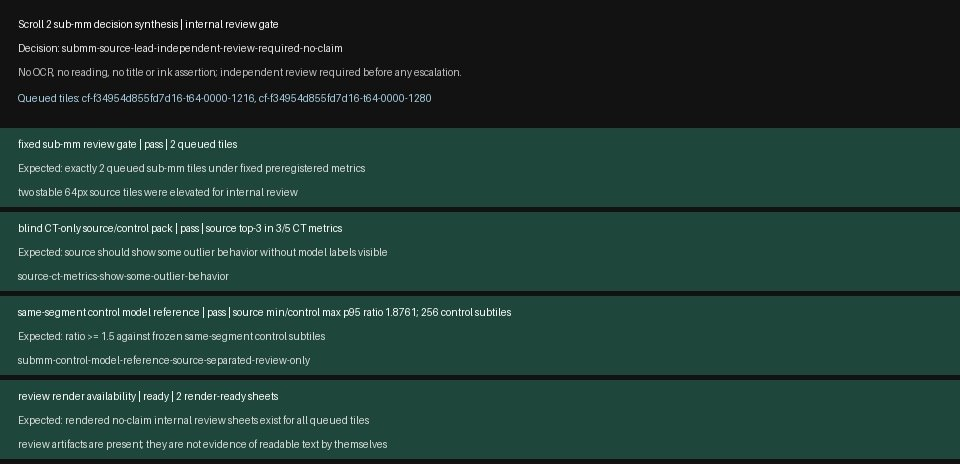

# Scroll Review Tooling

A small, reproducible review-gate toolkit for blind-first candidate
assessment. It validates reviewer responses, records second-check
decisions, and emits attention signals only when a controlled next step
is supported.

This repository is intentionally data-free. It contains synthetic demo
images and JSON only. It does not include Scroll CT data, collaboration
exports, model checkpoints, model outputs, OCR, transcriptions, or ink
claims.

## What It Does

- Creates a blind review response template from a bundle manifest.
- Validates reviewer responses against required acknowledgements and
  score ranges.
- Separates ambiguous review outcomes from controlled-next-step support.
- Runs a release audit for repository scope, secrets, heavyweight
  artifacts, and generated outputs.

## Sample Review Pack

The included images are synthetic fixtures. They show the intended
review format without carrying any real Scroll data.


The workflow is deliberately conservative: a reviewer can support a
controlled next step, but the tooling does not authorize transcription,
OCR, a public claim, or a prize submission.


## Why Synthetic Images?

Real candidate thumbnails can be useful in a private research review,
but they are not part of this tool package. Keeping the public-facing
demo synthetic makes the repository easy to share, test, and audit
without implying a reading, leaking collaboration context, or bundling
data that belongs in a separate evidence package.

If a team wants to review real candidate material, put those files in a
separate private evidence bundle and run the same response-validation
workflow against that bundle manifest.

## Interface

This release candidate is CLI-first. It does not include the internal
Scroll Autopilot GUI used during local exploration. That GUI controls
many project-specific pipelines and still contains internal workflow
assumptions, so it should be scrubbed and redesigned separately before
it is shared as a user-facing app.

## Demo

```bash
python -m scroll_review_tooling.review_workflow init-template --bundle demo/bundle_manifest.json --out demo/inbox/response_template.json
python -m scroll_review_tooling.review_workflow validate --template demo/inbox/response_template.json --inbox demo/inbox --out-json demo/out/review_status.json --out-tsv demo/out/review_status.tsv
python -m scroll_review_tooling.review_workflow second-check --review-status demo/out/review_status.json --out-json demo/out/second_check.json
python -m scroll_review_tooling.review_workflow attention --second-check demo/out/second_check.json --state demo/out/attention_state.json --out-json demo/out/attention.json
python -m scroll_review_tooling.release_audit --root . --out-json demo/out/release_audit.json
python -m unittest discover -s tests
```

Or run the same workflow with:

```bash
python scripts/run_demo.py
```

A supportive review creates an attention signal for a controlled next
internal method step. It never authorizes OCR, transcription, or a
public claim.

## Release Status

This is a review-tooling package, not a research result. Any real
ScrollPrize candidate still needs independent expert review, provenance,
scale, 3D position, reproducibility, and separate claim-safety approval.

## Repository Scope

This repository is suitable for private review of the tooling pattern.
It is not the full research workspace and intentionally excludes
research data, private notes, collaboration exports, local caches,
models, and generated candidate outputs.


<!-- PRIVATE_REAL_EXAMPLES_START -->
## Private Real Output Examples

This section is for the private review repository only. Remove this
section and `docs/private_examples/` before making the repository
public.

The images below are real local review artifacts from the candidate
pipeline. They show what a human reviewer would inspect: blind CT
sheets, control/model references, decision synthesis, and preflight
render context. They are not OCR, not a transcription, not a reading,
and not a public claim.

The overview flow uses cropped excerpts so that the content remains
legible in GitHub's README view. The full review sheets are embedded
underneath.


### Blind-first CT Review


### Control/Model Reference


### Gate Decision Synthesis



### Preflight Render Context


<!-- PRIVATE_REAL_EXAMPLES_END -->


